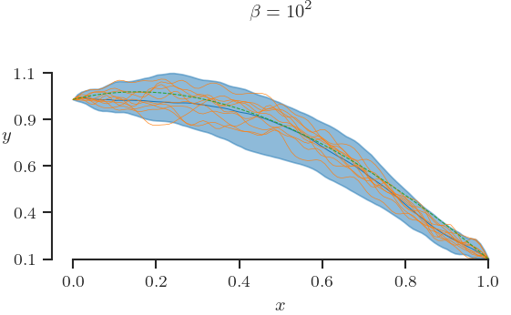
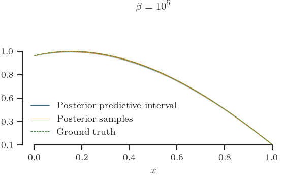

# Reproducing the results of Example 1

## Objective
The objective of this example is to demonstrate how the inverse temperature
parameter $\beta$ controls prior uncertainty.
Namely, we see that:
+ for small $\beta$ the prior is flat over the function space
+ for large $\beta$ the prior collapses to the solution of the boundary value
problem.

## Mathematical details
In this example the spatial domain is $[0, 1]$.
The boundary value problem is:

$$
\D \frac{d^2\phi}{dx^2} = q(x),
$$

with the source term being:

$$
q(x) = e^{-x},
$$

and the conductivity being:

$$
\D = 0.25.
$$

The boundary conditions are:

$$
\phi(0) = 1, 
$$

and

$$
\phi(1) = 0.1.
$$

The Hamiltonian is:

$$
H = \int dx \left\[\frac{1}{2}\D \left(\frac{d\phi}{dx}\right)^2 - \phi q\right].
$$

## Running the example

Make sure you have compiled the code following the instructions 
[here](../README.md).
The script [example01_run.sh](./example01_run.sh) reproduces the paper figures.
To run it, change in the directory `./examples` and type in your terminal:
```
./example01_run.sh
```

If you wish to change any of default settings, feel free to edit the 
corresponding configuration file: [example01.yml](./example01.yml).

## The results

The above script creates the following figures and puts them in a directory
called `example01_results`.





