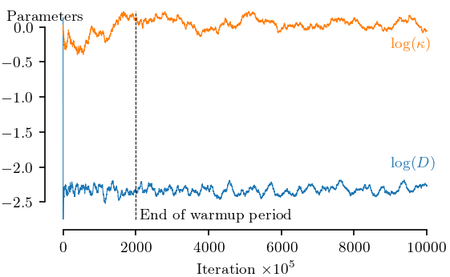
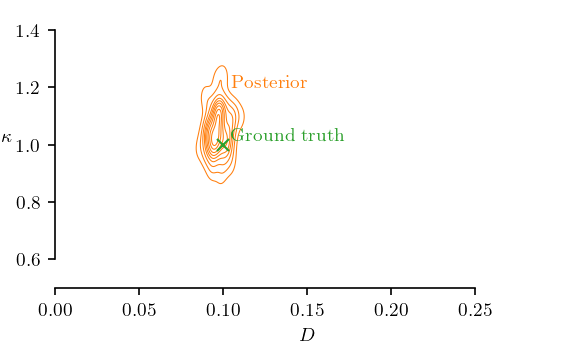
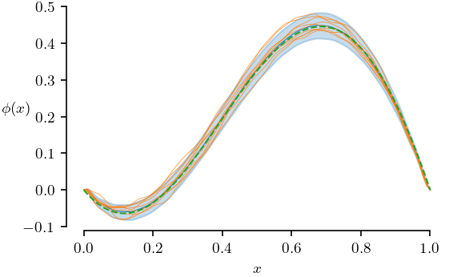
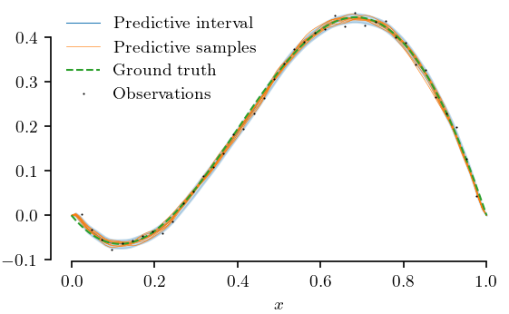
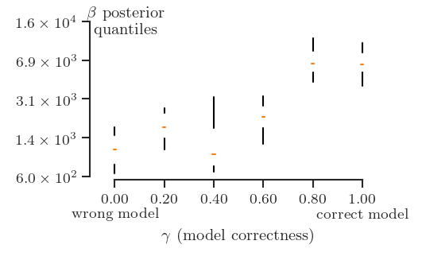

# Reproducing the results of Example 3

## Objective
The objective of this example is to demonstrate how the inverse temperature
$\beta$ detects model form error.
Namely, we see that:
+ if the model is correct, $\beta$ tends to be large
+ if the model is wrong, $\beta$ tends to be small.

## Mathematical details
The ground truth problem is as in [Example 2](./example02.md).
We reproduce here the details for your convenience.

The spatial domain is $[0, 1]$.
The ground truth field satisfies the equation:

$$
D\frac{d^2\phi}{dx^2} - \kappa \phi^3  = f,
$$

with source term:

$$
f(x) = \cos(4x),
$$

conductivity:

$$
D = 0.1,
$$

non-linear coefficient:

$$
\kappa = 1,
$$

and boundary conditions:

$$
\phi(0) = 0, 
$$

and

$$
\phi(1) = 0.
$$

We sample the field at $40$ equidistant points between $0$ and $1$ and we add
Gaussian noise with zero mean and standard deviation $0.01$.
The observed field inputs are [here](example02_n=40_sigma=1.00e-02_0_x_obs.csv)
and the observed field otuputs are [here](example02_n=40_sigma=1.00e-02_0_x_obs.csv).
If you wish to review how the observations were generated, consult the script
[example02_generate_observations.py](./example02_generate_observations.py).

The correct Hamiltonian for this problem is:

$$
H = \int dx \left\[\frac{1}{2}D \left(\frac{d\phi}{dx}\right)^2 + \frac{1}{4}\kappa\phi^4
+ \phi f\right].
$$

We solve two different inverse problems of increasing complexity and ill-posedness:

### Example 3.a: Model error in the source term

In this inverse problem we assume that the source term is known and we are
looking for $D$ and $\kappa$.
We use Jeffrey's priors on these parameters, i.e.,

$$
p(D) \propto \frac{1}{D},
$$

and

$$
p(\kappa) \propto \frac{1}{\kappa}.
$$

To enforce positive, we sample in the logarithmic space:

$$
\theta_1 = \log(D),
$$

and

$$
\theta_2 = \log(\kappa).
$$

### Example 3.b: Model error in the energy

As in Example 3.a both parameters $D$ and $\kappa$ are assumed to be uknown.
We use exactly the same treatement: Jeffrey's prior and work in logarithmic space.
However, we now assume that we do not know the source term $f(x)$.
To parameterize the source term we use a Fourier expansion with 15 terms.
We use a zero mean Gaussian prior on the Fourier coefficients.
The covariance of this prior is diagonal.
The prior variance of each Fourier weight decreases quadratically with the order
of the Fourier term.
This penalizes very high frequencies.

## Running the example

Make sure you have compiled the code following the instructions 
[here](../README.md).
The script [example03_run.sh](./example03_run.sh) reproduces the paper figures.
To run it, change in the directory `./examples` and type in your terminal:
```
./example03_run.sh
```

If you wish to change any of default settings, feel free to edit the 
corresponding configuration files:
+ [example03a.yml](./example03a.yml) for Example 3.a, and
+ [example03b.yml](./example03b.yml) for Example 3.b.

## The results

The above script creates the following figures and puts them in directories
called `example03a_results` and `example03b_results` for Example 3.a and 3.b,
respectively.

### Example 3.a ( $D$ and $\kappa$ unknown)







### Example 3.b ( $D$, $\kappa$, and $f(x)$ unknown)


